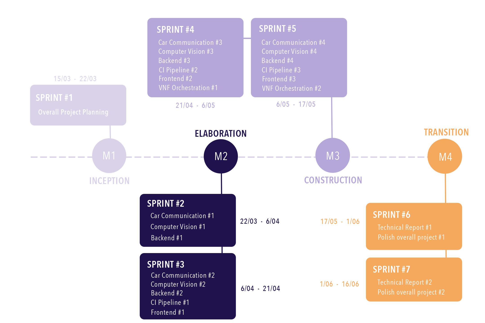
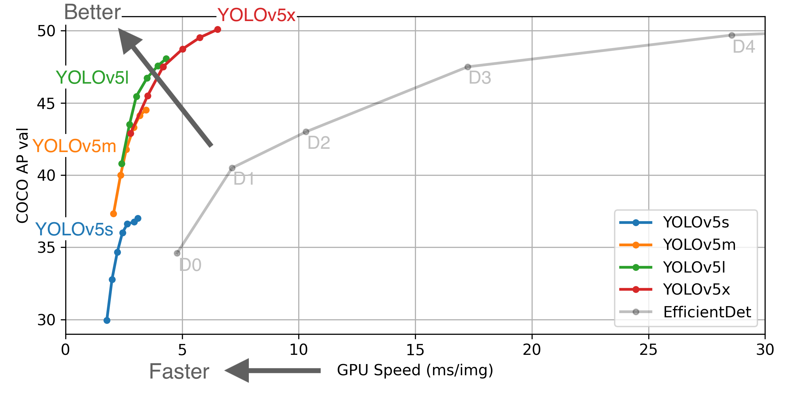

# 5G Mobility Documentation

### Table of contents

*  [Inception Phase](#inception-phase)
*  [Context](#context)
*  [Problem](#problem)
*  [Goals](#goals)
*  [Tasks](#tasks)
*  [Expected Results](#expected-results)
*  [Related Work](#related-work)
*  [Project Calendar](#project-calendar)
*  [Communication Plan](#communication-plan)
*  [Team Roles](#team-roles)
 

# Inception Phase
  
## Context

In 2019, 35.704 accidents with victims on Portuguese roads were reported, of which 626 resulted in fatal victims, 2.168 seriously injured and 43.183 with light injuries.

Since its creation, at the end of 2018, there has been a strong growth in the use of technologies using 5G network, since it allows to send data at high speed.

Therefore, the exponential growth of intelligent solutions for the most varied activities, as well as the lack of technology in the market related to 5G, leads to believing that there is a good opportunity to create a solution to improve road safety, benefiting from the advantages of using this technology.

## Problem

It is necessary to develop a service whose objective is to support the traffic control entities on roads, in order to have access to information and data processed practically in real-time.

It is intended to create a intelligent solution that takes advantage of traffic cameras and radars from the PASMO project, so that in the cloud computing environments from the 5GASP and the 5GAIner projects, it is possible to detect anomalous and relevant situations in the traffic flow of the A25, Praia da Barra and Costa-Nova.
  
It is also intended to implement a Car 2 Infrastructure / Infrastructure 2 Car communication using 5G, so that it is possible to exchange important information between vehicles.

## Goals

Among the most varied objectives to improve the detection of different situations on the roads, the application must provide a dashboard with information about:

### Traffic cameras and Radars from PASMO project
1. Number of vehicles to circulate (as well their velocity) at the moment and monthly
2. Traffic
3. Presence of animals, people or strange objects on the road
4. See the number of cyclists, runners or people walking on bike lanes
5. Detect inflow of the zone - with cameras estimating how many people are in Praia da Barra and Costa Nova. It also serves to tell if there are still parking spaces
6. Presence of stopped vehicles on the road

	**Nice to Have**
	1. Presence of vehicles on the side of the road
	2. The velocity on the radar can tell whether the road and the weather are in good conditions for the current velocity. If people go too fast the conditions are good

	**Future Work**
	1. Detect models of cars and check ambiental footprint taking in account max velocity allowed and model consumption

  
### Car 2 Infrastructure / Infrastructure 2 Car
1. Detect adverse conditions
	1. Rain sensors 
	2. Light sensors detect that the headlights turned on
	3. Detect if the fog headlights turned on
2. Calculate the carbon footprint by detecting the model of the car and how much it consumes
3. Warn cars if another one is coming their way with excessive speed. This can be important in terms of vehicles with priority

	**Nice to Have**

	1. Check if there are gas stations in the same road within a plausible distance, to know if with the current amount of gas/battery, a car can safely reach it. If a substantial number of cars pass with low amounts of gas and a gas station isn’t near, it might be a sign that there is a need to create a new one

	**Future Work**

	1. Explore additional features with this type of communication

  
### VNF Orchestration 

On the other end, it is important to develop a solution that is able to turn on or turn off cameras/servers programmatically, in order to manage the available resources in a better way possible. This will reduce the cost of systems renting, as a cloud service that makes available the VM´s that are used for data processing. Overall, the app may learn in which situations are necessary to change the VM´s state, e.g, if the camera goes down, the associated VM is turned off; If the camera becomes available again, the associated VM is restarted.

## Tasks

**Car Communication (Hugo Almeida e Orlando Macedo)** 

1. Research OBDII protocol
2. Implement a car emulator to receive and generate data
 
**VNF Orchestration (Hugo Almeida e Miguel Almeida)**

1. Research about VNF in 5G
2. Integrate developed VNF into 5GASP testbed

**Computer Vision (Miguel Almeida, Orlando Macedo e Carolina Araújo)**

1. Research for Machine Learning and pattern recognition tools
2. Train a custom Object Detection Model  

**Backend (Carolina Araújo e Hugo Almeida )**

1. Define what database to use for each scenario
2. Create the databases schema
3. Define the endpoints necessary to the API

**Frontend (Carolina Araújo e Hugo Almeida)**

1. Design and develop an interface for the web applications

**CI Pipeline (Orlando Macedo e Miguel Almeida)** 

1. CI Pipeline

## Expected Results

The goal of this project is to develop a set of VNF’s (Virtual Network Functions) that are capable of processing information from the video cameras and radars, notifying and storing data, using services and mechanisms made available by 5G. 

It must analyze data in order to know the number of vehicles that are driving above the speed limit, the monthly average of vehicles, etc.
Besides that, it is imperative that the system is flexible, i.e, it should be able to manage the number of cameras and radars being used, detecting when they stop streaming data.

With this system, the users will be able to use the provided data to:

- Decrease the costs of renting the VMs
- Learn when it’s in their best interest to increase/decrease the number of lanes
- Analyze statistics

With the communication between cars, it will be possible to determine the road conditions as well as to warn drivers in case of danger, such as with the arrival of vehicles at high speed.

## Related Work

### [5GASP](https://www.5gasp.eu)

Platform still under development based on existing inftra-structores that aims to shorten the idea-to-market process, offering a set of automated services, so that it is possible to develop and test new products built using 5G NFV architecture. 5GAPS offers software support tools, which cover use cases in different domains, in order to allow CI/CD of VNF´s in a secure and trustable environment. 

### [PASMO](https://pasmo.pt/project/pasmo)

The main objective of the PASMO project - Open Platform for the development and experimentation of Mobility Solutions is the design, implementation in the field and provision of a support platform for intelligent mobility, open to the participatory experimentation of companies that can effectively collaborate to test (technology ) and validate (market) equipment, protocols, processes, applications, standards and services.

PASMO project is hosted inside IT at Universidade de Aveiro, Portugal. Has as coordinator the Professor Joaquim de Castro Ferreira.

One of the projects associated with PASMO project is the dissertation of a student of UA, Rafael Oliveira. This dissertation is important in the way that has similar features to what should be implemented by us.

The motivation of Rafael was associated with the ambition of having a smart city. Regarding that, our colleague developed the following features:
- Map with vehicle velocities
- Dashboard with information about capacity at parking lots
- Dashboard regarding average velocity, percentage of vehicles caught speeding, etc.
- Information about radares and cameras, and their geographical location
- API exposing all the available functionalities

### [5GinFIRE](https://5ginfire.eu)

The main objective of 5GinFIRE is to build and operate NFV (Network Functions Virtualization) as an ecosystem of several experimental installations allowing the instantiation of software over them. It was a 3-year innovation and research project supported by the European Union, starting in January 2017.

With the growing popularity of Cloud services like those from Amazon or Google, more and more applications are hosted on this type of services. In recent years, most telecommunications service providers have incorporated some concepts and Cloud technologies in order to use homogeneous hardware, to disassociate applications from the hardware where they are being used and to manage resources so that they are more efficient. Network Functions Virtualization (NFV) were built based on these characteristics, running Virtual Network Functions (VNFs) on top of homogeneous hardware. Examples of this are routers, firewalls, NAT services, etc., all of which are virtualized, on similar hardware, and managed through NFV.
Most Cloud infrastructures are centralized data centers, which is not ideal for applications with some requirements such as low latency. Using NFV technology, on many occasions, VNFs are executed in specific locations on the network with the use of 5G, allowing for better latency.

5GinFIRE, based on these conclusions, designed and operated multiple installations with 5G NFV in order to allow the execution of VNFs, the management and allocation of resources and the communication between the various facilities.

### [China 5G Smart Highway](https://www.roadtraffic-technology.com/news/china-5g-smart-highway/)

In China’s most recent plant, 2015-2020, it’s been estimated that investments of upwards of $400 billions will be made in the 5G field, creating at least 8 million new jobs.According to Deloitte, China is leading the race on 5G.

Smart highways are being created, supporting cellular network-coordinated transportation, that will avoid the necessity of having humans controlling the traffic. An intelligent system with prediction abilities based on the traffic information fed in real time is expected to be created to help autonomous vehicles. This system will rely on more than two thousand 5G base stations. 

In Fangshan, the 5G technology will allow autonomous vehicles to communicate with each other in order to avoid collisions. 
Another chinese company is creating the first 5G electric and autonomous buses. 

## Project Calendar

Agile methodologies are applied, more specifically SCRUM, using Sprints of 2 weeks with rare exceptions:

---

### Sprint 1 - 15/03-22/03

Milestone 1 - presentation of the lifecycle objectives and calendar for the project

**Tasks**
  
1.  **Overall Project Planning**

---

### Sprint 2 - 22/03-06/04 

Milestone 2 - presentation of the lifecycle architecture; the milestone is achieved when the architecture has been validated

**Tasks** 

1.  **Car Communication #1**

2.  **Computer Vision #1**

3.  **Backend #1**

---

### Sprint 3 - 06/04-21/04 

Milestone 3 - prototype; mid-term presentation with supervisors; peer evaluation

**Tasks**

1.  **Car Communication #2**

2.  **Computer Vision #2**

3.  **Backend #2**

4.  **CI Pipeline #1**

5.  **Frontend #1** 

---

### Sprint 4 - 21/04-06/05

Milestone 3 - prototype; mid-term presentation with supervisors; peer evaluation 

**Tasks**

1.  **Car Communication #3**

2.  **Computer Vision #3** 

3.  **Backend #3**

4.  **CI Pipeline #2**

5.  **Frontend #2**

6.  **VNF Orchestration #1**

---

### Sprint 5 - 06/05-17/05 

Milestone 3 - prototype; mid-term presentation with supervisors; peer evaluation

**Tasks**

1.  **Car Communication #4**

2.  **Computer Vision #4**

3.  **Backend #4**

4.  **CI Pipeline #3**

5.  **Frontend #3**

6.  **VNF Orchestration #2**

---

### Sprint 6 - 17/05-01/06

Milestone 4 - project presentation; all functionality has been developed

**Tasks**
  
1.  **Technical report #1**

2.  **Polish overall project #1**

---

### Sprint 7 - 01/06-16/06 

Milestone 4 - project presentation; all functionality has been developed

**Tasks**
  
1.  **Technical report #2**

2.  **Polish overall project #2**

--- 

### Sprint 8 - 16/06-21/06

Milestone 4 project presentation; all functionality has been developed

**Tasks**

-  **(Not Planned)**

---

## Communication Plan

-  **Team Communication** - **Discord** was chosen since all team members are already familiar with the software.

-  **Backlog Management** - **Github Kanban** to record the backlog of tasks, being possible to associate each branch to an issue, track which issues are on-going, which have already been done or which are giving problems, for example. Each repository will have its issues, and there will be GitHub projects for each Sprint in the organization.

-  **Repository** - **Github** was chosen as the git platform to store the code based on an [organization](https://github.com/5g-mobility) that aggregates all the project's repositories and documentation.

-  **Git Workflow**

	The chosen workflow is based on the **feature-branching** with the following branches:

	

	-  **Master** - Main branch, where a commit is made for each release.

	

	-  **Develop** - Branch focused on development, where new branches for features come from and where they are at the end of their development.

	

	-  **Feature/*** - One branch per feature. It originates from develop and is where it is merged when finished. To merge, a pull request must be made.

	

	-  **Release/*** - This branch originates from develop and is generated at the end of each iteration, before its launch, for the final finishes. When the improvements are finished and the launch can be carried out, it is merged into the master.

	

	-  **Hotfix/*** - This branch originates from the master and is opened when there is a need to correct an error identified in production and which cannot wait for the next release to be corrected.

-  **Formal Meeting Platform** - **Zoom**

-  **File Sharing** - **Google Drive**

## Team Roles

-  **Advisor** - Prof. Diogo Gomes

-  **Co-Advisor** - Prof. Joaquim Ferreira

-  **Co-Advisor** - Prof. Rui L. Aguiar

-  **Product Owner** - Carolina Araújo

-  **Software Architect** - Hugo Almeida

-  **Team Manager** - Miguel Almeida

-  **DevOps Master** - Orlando Macedo

# Elaboration Phase

## Requirements Gathering 

1. To collect the requirements, the **first** thing that the group did was try to understand better all the technologies involved. In specific, technologies related to **5G communication**, real-time object detection and projects already made that could help us recognize better the functionalities that could be developed.
2. After collecting the knowledge about the domain, a **brainstorm** was made between the elements of the group. The major part of the ideas related to this project were made at this brainstorm.
3. At last, all the ideas/requirements were discussed with the advisor **Diogo Gomes** and co-advisor **Joaquim Ferreira**. The advisors selected in terms of easiness/risk of implementing these requirements, as well as whether they were feasible or not.

## Risks associated with the project
- The VNF infrastructure that our project will need is still in development, so this is something that the groups needs to have in count, because if the development of this infrastructure don't go as planned, such situation will be very problematic.
- 5G Broker isn't fully implemented yet, one more time, the good evolution of our project is somewhat dependent on the completion of the 5G Broker.
- There are legal risks associated with the fact that our project uses video streaming from public motorways, but all those risks were avoided meticulously.

## Contest and State of The Art (SOA)
### Context
At this section it will be presented a brief description of how the **system** is expected to be used by the **stakeholders**.

To start, vehicle drivers must have a OBU (on-board unit) that connects to the obd2 port of the vehicle. This connection allows the retrieval of information referent to the car. Lastly, this information is transmitted to our infrastructure, in order to be processed and provided on the web application, such service will help other drivers to drive more safely.

As it was said, the web application will have information associated with the traffic and can be accessed by everyone without the need to make login. The services provided by the web application will be detailed further up but succinctly we can talk about data referent to traffic at a specific zone, number of people cycling or running, and more.

### State of The Art (SOA)
#### Real-Time Object Detection
With the objective of implementing a **real-time object detection**, several of algorithms were considered. Among them **SSD** (Single Shot Detector), **R-CNN** (Region-based Convolutional Neural Networks), and, what turned out to be chosen, **YOLO** (You Only Look Once) due to the perception that this was the fastest algorithm with the best results.
This statement is proven by the following article from the authorship of [Ambika Choudhury](https://analyticsindiamag.com/top-8-algorithms-for-object-detection/).

> According to the researchers at Facebook AI Research, the unified architecture of YOLO is extremely fast in manner. The base YOLO model processes images in real-time at 45 frames per second, while the smaller version of the network, Fast YOLO processes an astounding 155 frames per second while still achieving double the mAP of other real-time detectors. This algorithm outperforms the other detection methods, including DPM and R-CNN, when generalising from natural images to other domains like artwork.

#### Car Communication
With regard to car communication, it was important to investigate technologies that could collect information from cars and forward them to our infrastructure. In this way, it was very productive to understand better the projects associated with **5GinFire**. In particular the **SURROGATES experiment**, this experiment used a OBU (on-board Unit) that forwarded the data of the car, that was being provided by the connection to the obd2 port from the car, to a RSU (Road Side Unit) that sent that data to a vOBU (virtual OBU), allocated on a remote location using **VNF**. So, this experiment was very important to understand what kind of technologies were being used and what we could also take advantage of.

The [Car 2 Car consortium](https://www.car-2-car.org/) was also crucial to understand what kind of services are being developed in the present in regard to car communication. Some of the requirements found were inspired by what this consortium is trying to achieve. One of those examples, is precisely the alert of careless drivers to the rest of the motorway users.
> "The basic principle is cooperation, i.e. the exchange of information between all road users, from road and rail vehicles to cyclists and pedestrians, and between road users and infrastructure elements such as traffic lights and road signs. All that happens in real time and at high speeds.” Fritz Kasslatter, Research Group industrial networks Austria

For more information, please read [this](https://assets.new.siemens.com/siemens/assets/api/uuid:e6d4f0d6ac7b3df9ee402860dc234cd52c7ee4c7/cooperativity-in-motion-en.pdf) article very insightful from **Siemens**.

#### 5G in Highways
To understand better if 5G technologies were being used in the highways, the same way that our group intended to do, a brief investigation was made, and we come across, among others, the article from [Road Traffic](https://www.roadtraffic-technology.com/news/china-5g-smart-highway).
In this article is said Chinese state-owned telecommunication company **China Mobile** is building a 5G smart highway project in Wuhan in Hubei province.

Their intention is to collect real-time traffic information, make AI-assisted forecasts using the data, which will support driverless cars. And this is possible due to the fact that 5G has **low latency** and allows communication between devices at real time.

#### 5GASP
**5GASP** is a project developed in [IT of Aveiro](https://www.it.pt/ITSites/Index/3) that will allow the group to test the VNF's created, making sure of CI/CD.

#### PASMO
PASMO project was implemented with the intention of making the city of Aveiro a lot smarter. With the use of radars, cameras that monitor the vehicle traffic and sensors that check the occupation of the parking lots of Barra beach.

The various services implemented in this project can be accessed at this [web portal](https://pasmo.pt/project/pasmo). The portal allows a better perception of the monitored places, most of all, allows a better informed reflection about the places to visit or the roads to travel.

### Actors
It is readily possible to understand two groups that will have great benefit with our project.

On the one hand, the **transport infrastructure operators**, this entities will be able to collect useful information about the state of the roads, wrong behavior on the part of drivers, as well as pollution statistics associated with an specific area.

On the other hand, **ordinary citizens** can also take advantage of our services in order to find out, for example, if it is worthwhile to go to a certain place, given that it may be affluent and therefore is overcrowded. Or something as simple as checking the traffic in a certain area.

In addition, if a citizen has a car equipped with technology that allows c2i-i2c communication, then she/he can also receive important information about the variables associated with the trip. Such as, climatic conditions or behavior of other road users that may put their own health at risk, as is the case of users who are speeding, therefore, requiring greater care.

To summarize, we present the following list with the main actors and a brief description:
- User of the web application
	- This actor uses the web application to check the traffic in a certain place or just to verify the weather in a zone. The web application doesn't have authentication, so anyone who needs information about the traffic can just open the browser, type our url, and prove whatever was needed.
- User with the OBU (c2i-i2c)
	- This actor will have a technology in his car that will allow sending data directly to a dedicated infrastructure. After, the user will then have access to data on what can be expected during his trip. Weather conditions or dangerous behavior on the part of other road users are some examples.

### Use Cases
To better understand what the users can expect from our system, it will be presented below the different use cases associated with the distinct interactions that can be done using the web application.

| Number        | Use Case           | Brief Description  | Priority |
| ------------- |:-------------:| :-----:| -----:|
| 1 | check number of vehicles currently circulating |  | High |
| 2 | see information about the traffic |  |
| 3 | check weather and adverse weather conditions |  | High |
| 4 | being alerted when some driver is being careless |  | High |
| 5 | verify if there are animals on the road or other strange objects |  | Medium |
| 6 | check the influx to a given area |  | Medium |
| 7 | see carbon footprint |  | Medium |
| 8 | check stopped cars on the road |  | Low |

